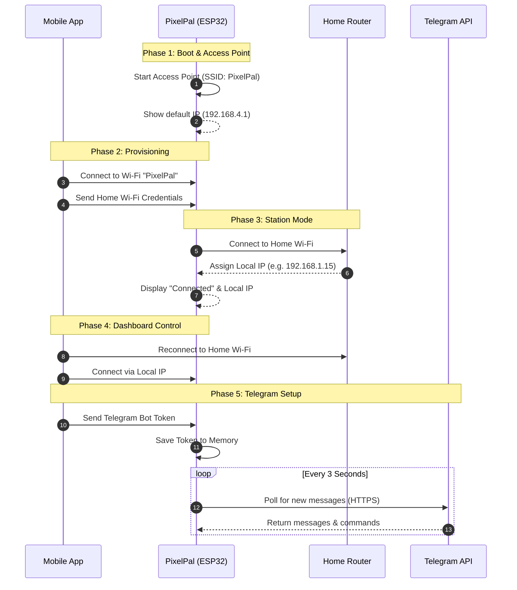

# PixelPal

PixelPal is a smart companion device built using an ESP32 microcontroller and an OLED screen, capable of showing facial expressions, a clock, weather information, and displaying messages sent via a Telegram Bot. It is accompanied by a Flutter mobile application that acts as a remote control and configuration tool.

## Motivation and Future Scope

This project was born out of a passion for making and a desire to learn. It started as a fun, experimental side-project to explore the intersection of hardware and software—specifically, bridging the gap between embedded C++ on microcontrollers and modern, cross-platform mobile app development using Flutter. 

While it currently serves as an interactive desk companion capable of displaying facial expressions, tracking the weather, and delivering Telegram messages, it is by no means a finalized product. PixelPal is a continuous learning playground. Moving forward, the project will be actively developed and expanded. Future enhancements may include implementing a dedicated battery circuit for full portability, integrating more advanced APIs, and expanding the mobile application's capabilities to allow custom user-drawn animations and extended IoT smart home features.

## Hardware Specifications

### 1. ESP32 Development Board
- Microcontroller: ESP32 (Dual Core 240MHz, 320KB RAM, 4MB Flash)
- Connectivity: Wi-Fi (802.11 b/g/n), Bluetooth v4.2 BR/EDR and BLE
- Features: Hardware-accelerated SSL/TLS, FreeRTOS support for multi-tasking
### 2. OLED Display
- Resolution: 128x64 pixels
- Interface: I2C
- Driver IC: SSD1306 (or compatible)
- Color: Monochrome (White/Blue)

### 3. Touch Sensor
- Type: Capacitive Touch Sensor (e.g., TTP223)
- Purpose: Used as a physical interrupt button to exit specific modes (e.g., Info Mode, Message Mode) and return to the default facial animation.

### 4. Battery (Upcoming Feature)
- Future iterations will include a Li-Po/Li-Ion battery with a charging module (e.g., TP4056) for portability. 
- A boost converter may be used if the 3.7V battery voltage needs to be stepped up to 5V for specific modules, though ESP32 and SSD1306 generally operate at 3.3V.

## Wiring Configuration

Below is the standard pinout configuration connecting the ESP32 to the external modules. 

### OLED Display (I2C)
- GND (OLED) -> GND (ESP32)
- VCC (OLED) -> 3.3V (ESP32)
- SCL (OLED) -> GPIO 22 (ESP32)
- SDA (OLED) -> GPIO 21 (ESP32)

### Touch Sensor
- GND (Sensor) -> GND (ESP32)
- VCC (Sensor) -> 3.3V (ESP32)
- SIG/I-O (Sensor) -> GPIO 23 (ESP32)

## Software Architecture

The project is divided into two main repositories/folders:
1. `pixelpal` (ESP32 Firmware written in C++ using PlatformIO)
2. `pixelpalmobile` (Mobile Application written in Dart using Flutter)

### ESP32 Firmware
- The ESP32 utilizes both of its cores. Core 1 is dedicated to drawing frames on the OLED display to ensure smooth 60fps animations. Core 0 handles Wi-Fi connectivity, HTTP servers, and Telegram API polling (via UniversalTelegramBot).
- Storage: Wi-Fi credentials and Telegram Bot Token are stored persistently using the ESP32 Preferences library (Flash memory).

## How to Run the Mobile Application

### Prerequisites
- Flutter SDK installed (Version 3.10 or newer recommended)
- Android Studio or Xcode (for iOS) installed
- An Android or iOS physical device, or an Emulator

### Steps to Run
1. Open a terminal or command prompt.
2. Navigate to the mobile app directory: 
   `cd C:\web\personalization\pixelpalmobile`
3. Download all required dependencies by running:
   `flutter pub get`
4. Connect your phone via USB (enable USB Debugging) or launch an emulator.
5. Run the application:
   `flutter run`
6. To build an APK for Android, run:
   `flutter build apk`

## Setup and Connection Workflow

To use the PixelPal device with the mobile app and Telegram, you must establish a connection sequence. This process pairs the ESP32 with your home Wi-Fi and the mobile application.

### Phase 1: ESP32 Access Point Mode
1. When the ESP32 is powered on for the first time (or after a reset), it cannot find a saved Wi-Fi network.
2. The ESP32 will automatically create its own Wi-Fi network (Access Point).
   - SSID: `PixelPal`
   - Password: `password123`
3. The OLED screen will display its default IP Address, typically `192.168.4.1`.

### Phase 2: Mobile App Provisioning
1. On your smartphone, go to your Wi-Fi settings and connect to the `PixelPal` network using the password `password123`.
   Note: Your phone might warn you that this Wi-Fi has no internet connection. You must choose to "Stay connected" and ensure Mobile Data is turned off to prevent the phone from routing traffic away from the ESP32.
2. Open the PixelPal mobile app. The app will open the "Wi-Fi Setup" screen.
3. Input your home Wi-Fi name (SSID) and your home Wi-Fi password.
4. Leave the ESP32 IP Address as `192.168.4.1`.
5. Press the "Kirim" (Send) button.
6. The app sends an HTTP GET request containing the credentials to the ESP32.

### Phase 3: ESP32 Station Mode
1. Upon receiving the credentials, the ESP32 OLED screen will display "Connecting to WiFi...".
2. The ESP32 will attempt to connect to your home Wi-Fi network.
3. If successful, the OLED will display "WiFi Connected!" along with the new Local IP Address assigned by your home router (e.g., `192.168.1.15`).
4. At this point, the ESP32 now has internet access.

### Phase 4: Reconnecting the Mobile App
1. Reconnect your smartphone to your home Wi-Fi network.
2. Open the PixelPal mobile app.
3. The app will automatically attempt to use the last known IP. If it fails, input the new Local IP Address shown on the ESP32 OLED screen into the app and connect.
4. You will be routed to the Control Dashboard.

### Phase 5: Telegram Bot Configuration
1. Obtain a Telegram Bot Token by talking to `@BotFather` on Telegram.
2. In the PixelPal mobile app (Control Dashboard), paste the Token into the Telegram Bot Setup input field.
3. Press "Kirim". 
4. The ESP32 will save this token to its internal flash memory and initialize the Telegram API listener.
5. The OLED screen will briefly display "Telegram Bot Set!".

## Usage and Operations

Once connected, you can interact with PixelPal using either the Mobile App or Telegram.

### Using the Mobile App
The Control Dashboard provides dedicated buttons that send HTTP requests to the ESP32 over the local network. 
- Face Modes: Normal, Smile, Look Left, Look Right, Blink.
- System Modes: Info Mode (Time, Date, Weather), Face Mode (returns to animation), Auto Mode.

### Using Telegram
Send messages to your bot on the Telegram app.
- Command Words: Sending `/smile`, `/left`, `/right`, `/blink`, `/info`, or `/face` will execute the respective actions on the ESP32.
- Text Messages: Sending any standard text (e.g., "Hello World") will trigger "Message Mode" on the ESP32. The text will be displayed prominently on the OLED screen.
- Auto-Dismiss: Message Mode automatically reverts to Face Mode after 10 seconds.
- Manual Dismiss: Touching the capacitive touch sensor will instantly dismiss Message Mode or Info Mode and return to Face Mode.
